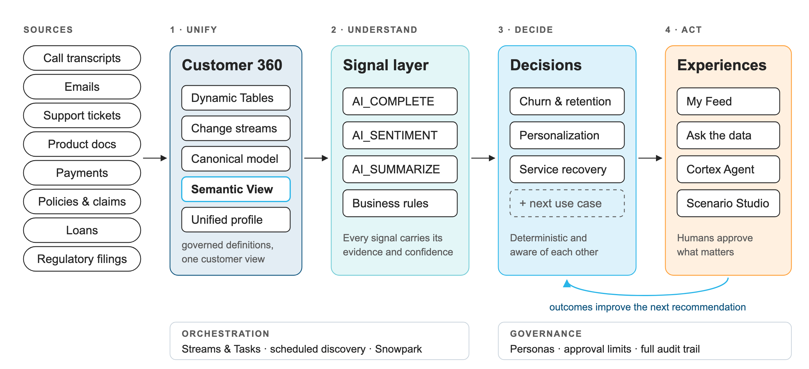

# Customer 360 Decisioning Platform

**Snowflake CoCo CLI Hackathon 2026 · GCC Edition**
**Team:** Simplifiers · **Problem statement:** #2 — Customer 360 and Next Best Action Engine

One platform that turns every customer touchpoint — policies, claims, payments, calls,
emails and tickets — into a single live customer view, reads what customers actually
say with Cortex AI, recommends the next best action with approved business rules, and
learns from every outcome. Everything runs inside Snowflake.

**And it extends itself, safely.** A domain expert describes a new use case in one
sentence in CoCo CLI. A multi-agent CoCo skill builds the signals, designs the offers
and guardrails, simulates the change on every customer and releases it as a versioned,
reversible configuration change — after four approvals, within bounds Snowflake
enforces. New use cases stop being projects. The first one built this way —
**Life-Event Cover Upgrade** — is live on this book and in a relationship manager's feed. [How it works ↓](#use-case-studio-a-multi-agent-coco-skill-that-extends-the-platform-safely)

---

## Try it

| | |
|---|---|
| **Demo video** | [Watch on YouTube](https://www.youtube.com/watch?v=HyYcURLRBt8) |
| **Presentation** | [Submission deck (PDF)](https://drive.google.com/file/d/1bszmRAkVNPa9-gPzX-5PgR6zFWfmVpD1/view?usp=drive_link) |
| **App** | [Customer 360 Decisioning Platform](https://app.snowflake.com/KRYZXYH/eg26106/#/streamlit-apps/CUSTOMER_360_DB.APP.CUSTOMER_360_APP) |
| **Account** | `KRYZXYH-EG26106` |
| **User** | `C360_JUDGE` |
| **Password** | `N!#^la4M#5ypy1` |
| **Role** | `C360_JUDGE` (default) |
| **Warehouse** | `COMPUTE_WH` (default) |
| **MFA** | Required. Snowflake asks for MFA setup on first login |
| **Extend it (CoCo CLI)** | `$c360-usecase Find health policyholders whose cover no longer fits their life and offer the right upgrade` — see [step 16](#how-to-test-each-feature) |

> **First login:** Snowflake requires multi-factor authentication for every Snowsight
> password login. After you enter the password, follow the prompt to register an
> authenticator (a passkey or an authenticator app such as Google Authenticator or
> Duo Mobile), then continue to the app link above.

The judge role can use the app, the Cortex Agent, the semantic view, both Cortex Search
services and the published CoCo CLI skills. Runs you make in the app are recorded and
can be undone from the sidebar (**Start over**), so you can't break anything for the
next judge.

> The first page load can take a few seconds while the warehouse starts.

---

## The problem

Insurers and lenders already hold the evidence of what a customer is about to do —
it's spread across systems nobody reads together.

- **Scattered data.** Policies, claims, payments, calls, emails and tickets live in separate systems.
- **Missed warnings.** A customer threatens to switch insurers on a call while their claim
  sits stuck for weeks. Nobody links the two.
- **Inconsistent action.** Every relationship manager decides alone, and nobody learns
  which actions actually work.

**Who it's for**

| Persona | Sees | Can do |
|---|---|---|
| Relationship Manager | their own book | work a ranked daily list, act on recommendations |
| Team Lead | the team's customers | approve larger offers (up to ₹83 lakh) |
| Analyst / Domain Expert | the whole book | tune signals, weights and rules without code |

Context: Indian health insurance and retail lending — IRDAI grievances, cashless
pre-authorisation, portability, EMI stress.

---

## Our approach: an enterprise decisioning platform

We built a platform that any customer use case plugs into, instead of a single churn
model. Five ideas carry it:

1. **Layered and isolated.** Unify → Understand → Decide → Act. Each layer only reads from
   the one before it, so any layer can change without touching the rest.
2. **AI reads, rules decide.** Cortex AI extracts facts from conversations into a fixed
   vocabulary, and every signal keeps the exact sentence that justifies it. Recommendations
   are scored by deterministic rules over measured track records, so the same input always
   gives the same, explainable answer.
3. **Learns from outcomes.** Every accepted or declined action updates the success rate and
   confidence the scoring reads next time.
4. **People in the loop.** The platform watches every customer on a schedule and routes each
   decision to the person with the right authority. Spending limits are enforced per role.
5. **Configuration-driven.** Signals, weights, limits, rules — and whole new use cases — are
   configuration. A third decision engine (Service Recovery) was added with 19 configuration
   rows and no engine code.
6. **Extends itself, within bounds.** Because a use case is configuration, a CoCo
   orchestrator skill and five specialist subagents can build one from a domain expert's
   brief: new signals measured for precision, offers only from the catalog, cited
   guardrails, a whole-book simulation through the production engine, and a release that
   Snowflake refuses unless the exact draft was simulated and approved. This is the part
   other Customer 360 builds don't have: the platform gets richer with every use case,
   and the next one is faster.

---

## Architecture



| Layer | What it does | Snowflake features |
|---|---|---|
| **1 · Unify** | 18 source tables mapped into one canonical model (customer, account, product, interaction, event) and a unified profile; a semantic view gives every consumer the same governed definitions | Dynamic Tables, Streams, Semantic View |
| **2 · Understand** | 25 signal definitions across Risk, Service and Opportunity; AI signals carry their evidence quote and confidence; daily discovery proposes new signals for an analyst to approve | AI_COMPLETE, AI_SENTIMENT, AI_SUMMARIZE, Snowpark |
| **3 · Decide** | Three independent engines — churn & retention, personalization, service recovery — on a shared signal vocabulary, with cross-domain suppression so nobody is upsold while at risk or owed a fix | Deterministic SQL scoring, decision registry |
| **4 · Act** | My Feed, chat, Cortex Agent and Scenario Studio; approvals by role; outcomes feed the learning loop | Streamlit in Snowflake, Cortex Agent, Cortex Search |
| **Orchestration** | Scheduled pipeline, change detection, daily signal discovery | Streams & Tasks, Snowpark Python |
| **Governance** | Personas and scopes, approval limits, full audit trail with undo | Role-based access |
| **Extend** | Use-case studio: brief → signals → playbook → simulation → versioned release, with approval gates, bounds and rollback | CoCo CLI skill + subagents + hooks, Snowpark Python, Cortex AI |

---

## What's in the app

The app has two modes, picked in the sidebar. **Acting as** switches the persona, which
changes what you see and what you're allowed to approve.

### Scenario Studio — the full loop on any customer

Pick a situation, give the system something new to react to, then walk the five stages.
Every figure is read back from Snowflake after the write that produced it.

| Step | What happens |
|---|---|
| **Stage an event** | Choose any of the 510 customers. Describe what happened in your own words and AI writes a realistic call grounded in that customer's real policies and claims — or pick a past call, or paste your own |
| **Detect** | The call is stored and read for signals; each one shows the evidence quote and confidence |
| **Understand** | The customer's state is recomputed; conflicting evidence is resolved by severity |
| **Decide** | Approved actions are ranked for your role, with the scoring explained and every spending limit checked |
| **Act** | The action is carried out, the customer is notified, and a call brief is written from their own evidence. A follow-up call can be fed back into the loop |
| **Learn** | The outcome is recorded and the recommender is re-run on the same customer to show what changed |

Four ready-made scenarios:

| Scenario | Customer | Shows |
|---|---|---|
| **A · Save the corporate account** | Arun Mehta (INS-1011) | the whole loop end to end, with contradictory evidence resolved |
| **B · When the machine must ask** | Suresh Reddy (INS-1005) | spending limits that block, and a person approving with a change |
| **C · Same engine, different industry** | Rekha Acharya (LND-2010) | the same engine running on lending, only configuration differs |
| **D · A customer we barely know** | Vikram Malhotra (INS-1007) | restraint — one weak signal is not grounds for an intervention |

### Operations Console — the everyday product

| Page | What it's for |
|---|---|
| **My Feed** | Today's ranked worklist across all three engines: at risk first, then customers we owe a fix, then genuine opportunities |
| **Decision Queue** | Who needs attention, ordered by severity and relationship value |
| **Approvals** | Offers waiting on your authority |
| **Customer 360** | Profile, why they're in their state, timeline, tickets, email threads, policy history, regulatory filings, recommendation |
| **Portfolio & Learning** | Value at risk by state, and each action's real track record |
| **Ask the data** | A chat that answers questions about any customer and remembers who you were asking about |
| **Config Studio** | Scoring weights by role, approval limits, state rules and signal definitions |
| **Signal Discovery** | Daily suggestions for new signals, ready to approve or dismiss |

---

## How to test each feature

Each check takes a minute or two. Unless noted, stay in the default persona
(**Relationship Manager 1**).

**1. One live customer view**
Operations Console → **Customer 360** → pick *INS-1011 — Arun Mehta*. You'll see his
relationship value, open tickets and SLA breaches, and alerts above the tabs. Open
**Why this state** to see every signal behind his risk level, which ones were read from
source systems and which were extracted from what he said.

**2. AI that cites its evidence**
In **Why this state**, the evidence column shows the transcript each AI signal came from.
In Scenario Studio, the **Detect** step shows each extracted signal with its supporting
quote and confidence.

**3. Next best action, explained**
Customer 360 → **Recommendation** tab. Each action shows its rank, track record, sample
size and whether it needs approval. Switch **Acting as** to **Team Lead** and reopen it —
roles weigh cost and value differently, so the order can change.

**4. The ranked worklist**
Operations Console → **My Feed**. Customers at risk come first with the retention action,
then customers we owe after a service failure, then product opportunities. Click
**Refresh** to bring the signals up to date.

**5. Cross-domain suppression**
In My Feed, notice that nobody at high risk is offered a product. In **Ask the data**,
type *"What product should we offer Arun Mehta at renewal?"* — the product comes back
held back, and **See the data behind this** gives the reason: he's at high churn risk, so
retention comes before any upsell.

**6. Ask in plain English, with follow-ups**
**Ask the data**, then try in order:
- *"Summarise customer INS-1005 for me"*
- *"What should we do about him?"* — resolves "him" to Suresh Reddy and runs the retention engine
- *"We let INS-1001 down — what should we do to make it right?"* — routes to service recovery
- *"Find calls about customers threatening to switch insurers"* — searches past calls
- *"What does the Super Top-up Health Cover include?"* — searches product documents

Each answer names the capability it used, and **See the data behind this** shows the
exact rows it came from.

**7. Human in the loop and spending limits**
Scenario Studio → **B · When the machine must ask** → walk to **Decide**. As a
Relationship Manager you can't approve the strongest option. Switch **Acting as** to
**Team Lead**, then approve or change the offer amount and watch the limit checks
re-evaluate. Operations Console → **Approvals** lists everything waiting on you.

**8. The learning loop**
Scenario Studio → **A** → complete **Act**, then **Learn**. The outcome updates the
action's track record, and the recommender is re-run on the same customer to show the
new ranking. **Portfolio & Learning** shows each action's success rate and flags any
that haven't been tried enough to trust.

**9. Domain portability**
Scenario Studio → **C · Same engine, different industry**. The same engine runs a lending
customer through the same steps with lending-specific actions.

**10. Restraint**
Scenario Studio → **D · A customer we barely know**. With only one weak signal, nothing
is recommended, and the app explains why.

**11. Configuration, not releases**
Switch **Acting as** to **Analyst / Domain Expert** → **Config Studio**. Review scoring weights by role,
approval limits, the state ladder and every signal definition, with how each one is found.

**12. Self-improving signal layer**
**Signal Discovery** (as Analyst / Domain Expert) → **Run discovery now**. The platform scans data
nothing is using yet, proposes new signals with an AI summary of what changed, and waits
for you to promote or dismiss each one.

**13. Cortex Agent**
In Snowsight, open **AI & ML → Agents** (or Snowflake Intelligence) and choose
`CUSTOMER_360_AGENT`. Ask *"Who needs attention today?"* or *"What should we do about
Suresh Reddy?"*. It uses the same tools as the app.

**14. Governed analytics**
In Snowsight, open **AI & ML → Cortex Analyst** with the semantic view
`CUSTOMER_360_DB.APP.CUSTOMER_DECISIONING_VIEW` and ask a portfolio question in plain English.

**15. CoCo CLI skills**
The four skills are published to the stage `@CUSTOMER_360_DB.APP.SKILLS/`. With CoCo CLI
connected to the account, add them with `cortex skill add @CUSTOMER_360_DB.APP.SKILLS/`,
confirm with `cortex skill list`, then ask *"What should we do about Suresh Reddy?"*.

**16. Use-case studio (CoCo CLI, multi-agent)**
From a clone of this repository (so CoCo picks up `.cortex/agents` and the hook), run
`$c360-usecase Find health policyholders whose cover no longer fits their life and offer the right upgrade`
and answer `approve` at each of the four gates. Or run it unattended:
`$c360-usecase --replay tests/scenarios/A_life_event_upgrade.yaml`. Then try
`tests/scenarios/C_bounds_hold.yaml` to watch the bounds refuse an unsafe change.

---

## Snowflake capabilities used

| Capability | Used for |
|---|---|
| Dynamic Tables | keeping the unified customer view current |
| Streams & Tasks | detecting change and running the pipeline on schedule |
| Snowpark Python | portfolio-wide scoring and signal discovery |
| Semantic View | shared, governed business definitions |
| AI_COMPLETE | intent from calls, held to a fixed list, with structured output |
| AI_SENTIMENT | tone of every conversation |
| AI_SUMMARIZE | a customer's history in one paragraph |
| Cortex Search | searching calls, emails and product documents |
| Cortex Agent | natural-language access to every tool |
| Streamlit in Snowflake | the app, running next to the data |
| Role-based access | each persona sees only its own book |
| CoCo CLI | built the platform and packages it as reusable skills |
| CoCo CLI subagents and hooks | the use-case studio: five specialist agents under one orchestrator skill; a hook that blocks direct production writes |

## CoCo CLI

CoCo CLI was used end to end: to generate the synthetic seed data, to build the
pipeline, semantic view and agent, and to package the platform as four reusable skills
published to a Snowflake stage.

| Skill | What it does |
|---|---|
| **c360-customer-query** | answers any question about a customer by routing it to the one capability that answers it, grounded in what that capability returns |
| **c360-signal-onboarding** | discovers, reviews and adds new signals for every engine to use |
| **c360-decision-domain** | onboards a new decision use case as configuration |
| **c360-decision-audit** | verifies a decision engine is repeatable, guarded and learning |
| **c360-usecase** | the use-case studio orchestrator below: brief in, released use case out |

### Use-case studio: a multi-agent CoCo skill that extends the platform safely

> **Our differentiator.** New use cases stop being projects: a domain expert adds or
> tunes one from CoCo CLI, every change is simulated on the whole book and bounded by
> Snowflake, and every release is versioned and reversible. Full guide, comparison and
> demo script: [docs/usecase-studio.md](docs/usecase-studio.md).

A domain expert types one brief into CoCo CLI. One orchestrator skill takes it to
a released, versioned use case, with the expert approving four gates and nothing
else. Five specialist **CoCo subagents** (`.cortex/agents/`) do the work of each
layer:

| Gate | Subagent | What it does |
|---|---|---|
| G1 · card and plan | **c360-scout** (read-only) | reads the registries and the data; reuse vs build, tool choice, success metric, overlaps with live packs |
| G2 · signals | **c360-signal-builder** | builds new signals from records (SQL) or from what customers said (AI with a fixed label list and the quote); measures precision with a 95% interval; tightens its own definitions until they pass |
| G3 · playbook and simulation | **c360-nba-designer**, **c360-simulator** | offers from the catalog only, cited guardrails; the whole book run through the production engine: reach, mix, held-back customers, conflicts, before/after |
| G4 · release | **c360-release-manager** | the only path to production: versioned, with one-call rollback |

**Agents are roles, skills are procedures, registries make it generic.** The
agents never hard-code insurance: they read the signal, action and use-case
registries, so the same skill works for any line of business.

**Standardised, simulated, bounded — enforced in Snowflake, not in prompts**
(`sql/app/26_usecase_studio.sql`):

- **One engine.** The simulation uses the same engine production serves from,
  verified row for row against the live generic engine. What you simulate is
  what ships.
- **Bounds B0–B9.** Weights capped, offers only from the catalog, every
  guardrail cited, guardrails can never be removed, legacy engines can't be
  edited, no dead rules or empty signals.
- **Hash-bound approvals.** Change the draft after an approval and the
  approval no longer counts; the release procedure refuses.
- **A hook** (`.cortex/hooks/guard_prod.py`) blocks any direct write outside
  the sandbox, so even a misbehaving agent can't touch production.
- **Reversible.** Each release snapshots what it replaced; rollback restores it exactly.


#### Built by the agents: Life-Event Cover Upgrade, live today

```text
$c360-usecase Find health policyholders whose cover no longer fits their life and offer the right upgrade
```

This use case was built end to end by the `c360-usecase` skill and its five CoCo subagents, from that one sentence and four approvals. It is live: Relationship Manager 1 sees its offers in **My Feed** and acts on them from **Customer 360**. Every artifact is in `runs/UC-20261005-2055/` and every gate decision in `STUDIO.RUN_LEDGER`. Run the same command to build your own:

| Gate · subagent | What it produced |
|---|---|
| **G1 · card and plan** — *c360-scout* | in scope, NEW pack, tier GROW; 6 signals reused (`product_interest`, `renewal_proximity` and four guardrail signals; two more join as guardrails at G3) and two to build: `cover_gap` from policy and claims records, `life_event` from what customers said |
| **G2 · signals** — *c360-signal-builder* | `cover_gap` on 220 customers. `life_event` was measured by an independent AI check of every positive: round 1 scored 0.81 but its 95% lower bound (0.696) missed the 0.70 gate — a mother-in-law and a parent in ICU had been counted as dependent parents. The builder tightened the definition twice, then **dropped the `parent_dependent` label** rather than ship it (its own lower bound was 0.49). Final: **precision 0.91, 95% interval 0.72–0.98**, 22 customers, every one with the quote |
| **G3 · playbook and simulation** — *c360-nba-designer, c360-simulator* | three offers, all from the catalog; "add a member to the floater" and "cover for a non-senior's parents" aren't in the catalog, so they're catalog requests, not invented offers. Bounds B0–B9 pass first time. The first simulation found **3 customers also owed a fee waiver by service recovery**; the designer added cited guardrails on the service signals and the second simulation showed 0 conflicts: 278 match, **157 reached**, 121 held back (95 at churn risk, 26 by guardrails), **0 violations**, deterministic |
| **G4 · release** — *c360-release-manager* | version 1 goes live as **23 configuration rows** (1 use case, 3 offers, 9 rules, 8 guardrails, 2 signals), no engine code. Rohit Joshi (INS-1009, Relationship Manager 1's book) gets Super Top-up because his Family Floater is ₹5 L and he said *"Meri wife ka delivery hua Manipal Hospital mein"* — and it's now in RM 1's **My Feed** and on his Customer 360, where the RM records the customer's answer |

Then change it:

```text
$c360-usecase --modify life_event_upgrade Super top-up is offered too widely; only offer it when the cover gap is HIGH.
```

The simulation shows before/after — customers gained, lost and whose offer changed — and
the release becomes version 2. Ask for something unsafe — *"weight 5 on cover gap and
drop the poor-service guardrail"* — and the bounds refuse both (B4, B8) with the reason.
`CALL CUSTOMER_360_DB.STUDIO.ROLLBACK_RUN('<run_id>')` puts back exactly what was there.

#### Why it fits this platform so well

The studio adds no new engine. It stands on what the platform already is:
use cases are configuration (the decision registry), signals share one vocabulary with
evidence (the signal layer), decisions are deterministic (so a simulation is an exact
preview), and every write is auditable and reversible (run logging and undo). The studio
just makes that configuration safe for a domain expert to change — and every run leaves
the catalogs richer, so the next use case reuses more and builds less.

The same skill tunes a live pack (showing before/after), refuses unsafe changes
with the reason, and routes out-of-scope requests such as claim auto-approval.
Replay scenarios in `tests/scenarios/` run the whole flow without a person.

---

## Data

A synthetic Indian book, generated with CoCo CLI. The first 30 customers were seeded from
Kaggle and IRDAI samples; the book was then scaled to 510 using those customers as the
reference — same tables, same value ranges, same ticket and email templates — with no other
data source. Each new customer follows one story (a delayed claim, a premium shock, a
cashless denial at the hospital, mis-selling, a delisted hospital, failed auto-debits, an
affordability downgrade, repeated service failures, a group renewal at risk, or interest in
maternity, senior, critical-illness, OPD, super top-up or corporate top-up cover), and that
story drives every record, so the whole signal vocabulary fires from independent sources.
Generation is deterministic (`scripts/generate_scale.py`). No real customer data is used.

| | |
|---|---|
| Customers | 510 (500 health insurance, 10 retail lending), across 15 relationship managers in 5 teams |
| Source tables | 18, about 11,900 records |
| Conversations | 295 call transcripts in English and Hinglish, 2,058 emails, 1,523 support tickets |
| Transactions | 652 policies and 3,617 policy versions, 1,903 payments, 215 claims, 15 loans |
| Reference | 11 product documents, 38 IRDAI grievances, 54 portability requests, 35 employer groups |
| Live signals | 2,796 across 19 signal types; 1,245 read by AI from what customers said, each with its quote |

## Enterprise readiness

- **Stays in Snowflake** — data, AI and the app all run inside the account.
- **Scoped by role** — relationship managers see their own book, team leads their team, analysts everything.
- **Spending limits** — offers above a role's limit wait for someone with the authority.
- **Evidence for every signal** — each AI signal keeps the quote and confidence behind it.
- **Repeatable decisions** — the same input always gives the same answer.
- **Full audit trail** — every recommendation, action and outcome is recorded and reversible.
- **Safe change** — new and changed use cases go through approval gates, a whole-book
  simulation and hard bounds; approvals are bound to the exact draft; every release is
  versioned and rolls back in one call; agents physically can't write to production.

## Built to extend

- **A new use case in one CoCo CLI session.** The use-case studio turns a domain expert's
  brief into a released pack: reused and new signals, catalog offers, cited guardrails,
  a simulation of every customer, four approvals. The life-event upgrade below, built by
  the skill and its subagents, came to 23 configuration rows and no engine code, released in one session — Service Recovery,
  built by hand, took 19.
- **Any domain, same skill.** The agents read the platform's registries — signals, offers,
  use cases, capabilities — and never hard-code insurance. Point them at lending,
  mutual funds or telecom and the same orchestrator, gates and bounds apply.
- **A new domain in about 3 weeks** with a domain expert — for example mutual funds, with
  use cases like SIP stop risk, redemption intent on calls, tax-season fund fit and failed
  mandate recovery.
- **Scales at marginal cost.** The customer view refreshes incrementally, so AI cost grows
  with new conversations and rule cost with changed customers, not with the size of the book.
- **Next:** connect real CRM, policy, loan and contact-centre sources; post approved actions
  and studio gates to Slack and Jira; finer access policies by region and branch; an AI
  onboarding wizard in Streamlit that puts the studio's gates on a guided screen; let the
  studio also onboard new sources and train ML signals once outcomes accumulate.

## Repository layout

| Folder | Contents |
|---|---|
| `sql/` | platform build, layer by layer |
| `streamlit/` | the app |
| `skills/` | the five CoCo CLI skills, including the `c360-usecase` orchestrator |
| `.cortex/` | CoCo subagents (`agents/`) and the production-write guard hook (`hooks/`, `settings.json`) |
| `tests/scenarios/` | replayable use-case studio scenarios (new pack, tune, bounds, out of scope) |
| `runs/` | artifacts of each use-case studio run: card, plan, signals, playbook, simulation, release |
| `deck/` | submission deck and its editable architecture diagrams |
| `docs/` | architecture images, the use-case studio guide and the manual onboarding playbook |
| `scripts/` | data generation helpers |
