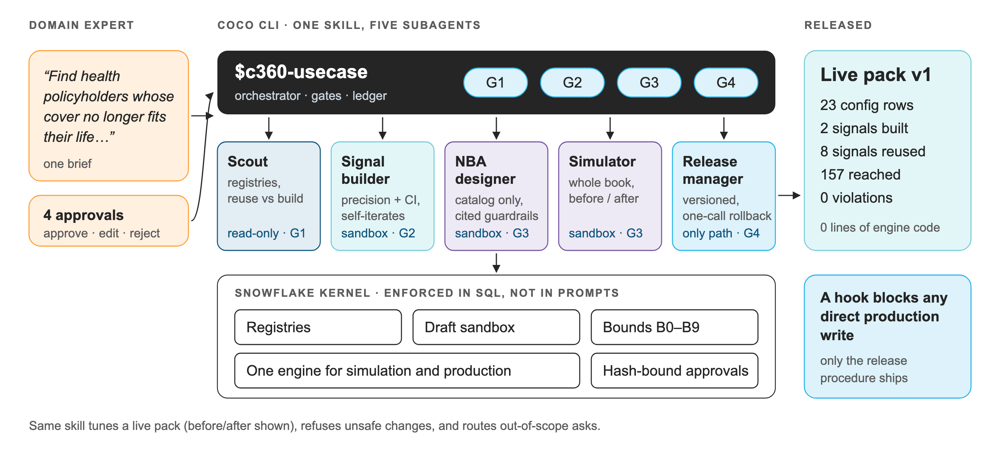

# Use-case studio

**One brief in CoCo CLI → a released, versioned, reversible use case.**
A domain expert describes what they want in one sentence and approves four gates.
An orchestrator skill and five specialist CoCo subagents do the rest, and
Snowflake — not the prompt — enforces what any change is allowed to do.



---

## Why this is the differentiator

Most Customer 360 builds stop at "here is a churn model and a dashboard". Every new
use case after that is another project: new code, new pipeline, a new deploy, and
a new chance to break the ones that already work.

This platform was built so that a use case is **configuration**, not code (Service
Recovery: 19 rows, no engine changes). The studio turns that property into a
product for the business:

| | Typical build | This platform |
|---|---|---|
| Who adds a use case | an engineer | a domain expert, in CoCo CLI |
| How long | weeks | one session, four approvals |
| What it changes | engine code | configuration rows, versioned |
| How you know it's safe | test in production | whole-book simulation through the production engine, before release |
| What stops a bad change | code review | hard bounds in Snowflake + hash-bound approvals + a hook that blocks direct writes |
| How you undo it | redeploy | one call restores exactly what was there |
| What the next use case costs | the same again | less: every run adds signals and offers the next one reuses |

## How it fits the platform — nothing new underneath

The studio adds no engine. It stands on four properties the platform already has:

1. **Use cases are configuration** — the decision registry
   (`CONFIG.DECISION_DOMAIN / DECISION_CANDIDATE / DECISION_RULE`) and the generic engine.
2. **One shared signal vocabulary, with evidence** — every engine reads the same
   signals; AI signals keep their quote and confidence.
3. **Deterministic decisions** — so a simulation is an exact preview, not an estimate.
   `APP.PACK_ENGINE` (the set-based engine the simulator uses) is verified row for row
   against the live `APP.RECOMMEND_GENERIC`.
4. **Everything recorded and reversible** — runs, approvals and releases are logged;
   rollback restores the snapshot.

## The architecture: one orchestrator skill, five subagents, one kernel

| Piece | Where | Role |
|---|---|---|
| `c360-usecase` skill | `skills/c360-usecase/` | orchestrator: scope check, routing, the four gates, the ledger |
| `c360-scout` | `.cortex/agents/` | read-only: registries and data → use-case card, reuse vs build, tool choice |
| `c360-signal-builder` | `.cortex/agents/` | new signals from records (SQL) or from what customers said (AI label + quote); precision with 95% CI; fixes its own definitions |
| `c360-nba-designer` | `.cortex/agents/` | offers from the catalog only, bounded rule weights, cited guardrails; catalog requests for anything missing |
| `c360-simulator` | `.cortex/agents/` | whole book through the production engine: reach, mix, held back and why, conflicts, violations, before/after |
| `c360-release-manager` | `.cortex/agents/` | the only path to production; verifies serving after release |
| Kernel | `sql/app/26_usecase_studio.sql` | registries, draft sandbox, bounds B0–B9, simulator, hash-bound release, rollback |
| Hook | `.cortex/hooks/guard_prod.py` | blocks any SQL write outside the `STUDIO` sandbox — even with `--bypass` |

**Agents are roles, skills are procedures, registries make it generic.** No agent
knows it's working on insurance: they read the signal catalog, the action catalog
and the use-case registry. Point the same skill at lending, mutual funds or telecom
and the gates, bounds and release path are unchanged.

## Built by the agents: Life-Event Cover Upgrade (live today)

The first use case built with the studio. The `c360-usecase` skill and its five CoCo
subagents took it from one sentence to a released pack in Relationship Manager 1's feed.

## Try it yourself (5 minutes)

From a clone of this repository, with CoCo CLI connected to the account:

```text
$c360-usecase Find health policyholders whose cover no longer fits their life and offer the right upgrade
```

Answer `approve` at each gate. What the agents produced for the live use case (`runs/UC-20261005-2055/`):

| Gate | Evidence shown |
|---|---|
| **G1 · plan** — *scout* | in scope, NEW pack, tier GROW; 6 signals reused (8 by release); 2 to build — `cover_gap` (records) and `life_event` (calls) |
| **G2 · signals** — *signal builder* | `cover_gap` on 220 customers; `life_event` round 1 precision 0.81 but lower bound 0.696 < 0.70 (a mother-in-law and a parent in ICU counted as dependent parents); two tightening rounds, then the `parent_dependent` label was **dropped** (lower bound 0.49) instead of shipped; final **0.91 (95% CI 0.72–0.98)** on 22 customers |
| **G3 · playbook + simulation** — *designer, simulator* | 3 catalog offers, 2 catalog requests (add a member; cover for a non-senior's parents); bounds pass first time; first simulation flags 3 customers also owed a fee waiver → designer adds cited service guardrails → 278 match, **157 reached**, 121 held back, **0 conflicts, 0 violations** |
| **G4 · release** — *release manager* | version 1 live as **23 configuration rows**; `RECOMMEND_PACK('life_event_upgrade', 'INS-1009')` → Super Top-up (cover gap + *"Meri wife ka delivery hua…"*), now in Relationship Manager 1's feed |

Then:

```text
$c360-usecase --modify life_event_upgrade Super top-up is offered too widely; only offer it when the cover gap is HIGH.
```
Before/after shows customers gained, lost and whose offer changed → version 2.

```text
$c360-usecase --modify life_event_upgrade Weight 5 on cover gap, and drop the poor-service guardrail.
```
Refused: B4 (weight outside 0.05–2.0) and B8 (a live guardrail can't be removed).

```sql
CALL CUSTOMER_360_DB.STUDIO.ROLLBACK_RUN('<run_id>');   -- back to exactly what was there
```

Unattended: `$c360-usecase --replay tests/scenarios/A_life_event_upgrade.yaml`
(also `B_tune_pack`, `C_bounds_hold`, `D_out_of_scope`).

## 3-minute demo script

| Time | Show | Say |
|---|---|---|
| 0:00 | the brief typed into CoCo CLI | "Every new use case is usually a project. Here it's one sentence." |
| 0:20 | G1 card: 6 signals reused, 2 to build | "It reads the platform's own catalogs first — reuse before build." |
| 0:50 | G2: precision rounds, the dropped label, the rejected quotes | "It measured its own AI signal, caught it counting in-laws as parents, and dropped what it couldn't make reliable — before asking me." |
| 1:30 | G3: 157 reached, 121 held back, 3 conflicts fixed, 0 violations | "Every customer simulated through the exact engine production uses. Nobody at risk or owed a fix gets upsold. It can't invent a product." |
| 2:10 | try to write to CONFIG directly → hook blocks it | "Even the agents can't touch production. Only the release procedure can, and only for what I approved." |
| 2:30 | G4 release → RM 1's My Feed and Rohit Joshi's Customer 360 | "Live, versioned, 23 rows, no engine code — on the RM's worklist, and one call to roll back." |
| 2:50 | close | "The next use case reuses everything this one built." |

## What it deliberately doesn't do (yet)

Claim adjudication, credit and pricing decisions, edits to the two legacy engines,
forecasts and ML training are routed out with the reason and the right tool
(`STUDIO.CAPABILITY`). New raw sources go through mapping first. Next on the
roadmap: let the studio onboard sources and train ML signals behind the same gates.
